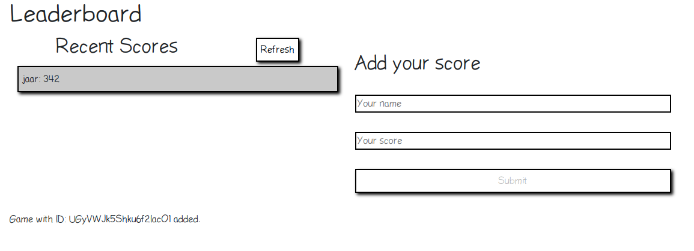

# LeaderBoard

A board that will print user and its scores using a API service to get the users and add the users.

## Live Server
- [Live version](https://jaar91.github.io/LeaderBoard/)

## Built With

- HTML
- CSS3
- JavaScript
- BootStrap

## How to get API key

To get the api, add the follow code to the index.js:
```
import gameId from './gameId.js';
```
Then call the function gameId at the end on index.js:
```
gameId();
```
That is going to return a the game id to the bottom of the page:


Copy the code to APIhandler.js, on line 4 and remove the lines you just added to the index.js

## Run Project

To get a local copy of the repository please run the following commands on your terminal:

```bash
$ cd <folder>
$ git clone git@github.com:JAAR91/LeaderBoard.git
$ cd LeaderBoard
```

First you need to install all  the dependencies requiered, so use:
```
npm install
```
Now open the dev server:
```
npm start
```
or you can bundle everything with:
```
npm run build
```

## Author

👤  **Jose Alberto Arriaga Ramos**

- GitHub: [@jaarkira](https://github.com/jaarkira )
- Twitter: [@91_jaar](https://twitter.com/91_jaar )
- LinkedIn: [Jose Arriaga](https://www.linkedin.com/in/jaar/)


## 🤝 Contributing

Contributions, issues and feature requests are welcome!

Feel free to check the [issues page](https://github.com/JAAR91/weatherapp/issues).

## Show your support

Give a ⭐️ if you like this project!

## 📝 License

This project is [MIT](./MIT.md) licensed.